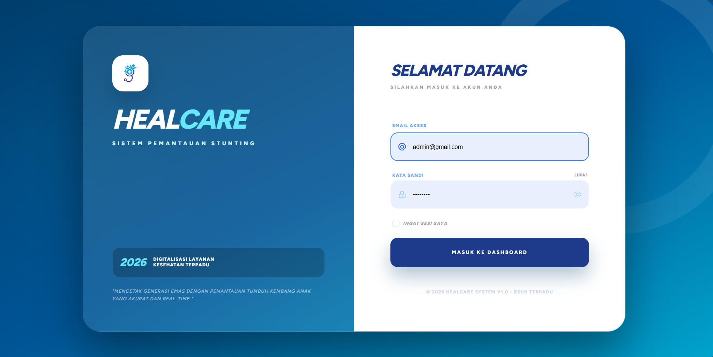
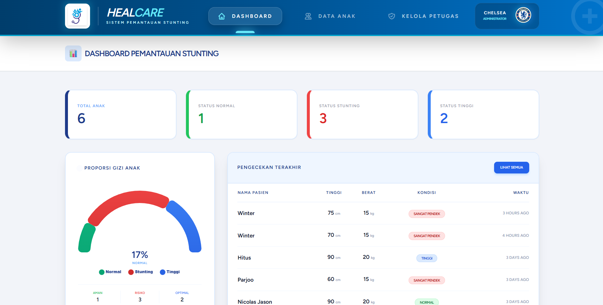

# 🏥 HealCare - Smart Stunting Monitoring

HealCare adalah platform digital terpadu untuk memantau tumbuh kembang anak guna mencegah stunting secara dini. Didesain dengan antarmuka modern dan sistem keamanan yang kuat.

## ✨ Fitur Utama
* **Dashboard Real-time**: Visualisasi grafik pertumbuhan anak yang intuitif (Antropometri).
* **Manajemen Data Anak**: Pencatatan rutin Tinggi Badan (TB) dan Berat Badan (BB).
* **Multi-role Access**: Sistem login khusus untuk Admin, Petugas Kesehatan, dan Orang Tua.
* **Glassmorphism UI**: Antarmuka modern dengan efek blur transparansi yang elegan. 

## 🚀 Tech Stack
* **Framework**: Laravel 11
* **Styling**: Tailwind CSS
* **Interactivity**: Alpine.js
* **Database**: MySQL

## 🛠️ Instalasi
1. Clone repository:
   ```bash
   git clone [https://github.com/piscesbluu29/HealCare.git](https://github.com/piscesbluu29/HealCare.git)

## 📸 Tampilan Aplikasi

### 🔐 Halaman Akses (Login)


### 📊 Dashboard Monitoring

